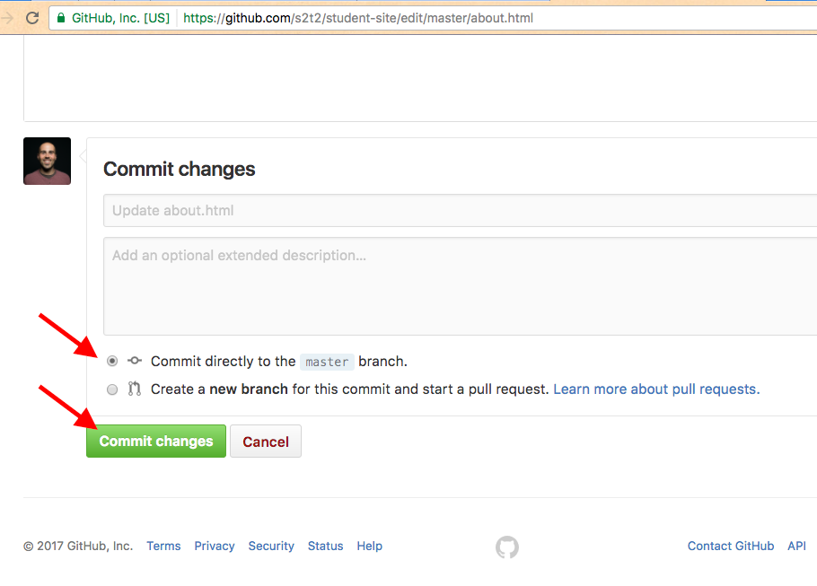
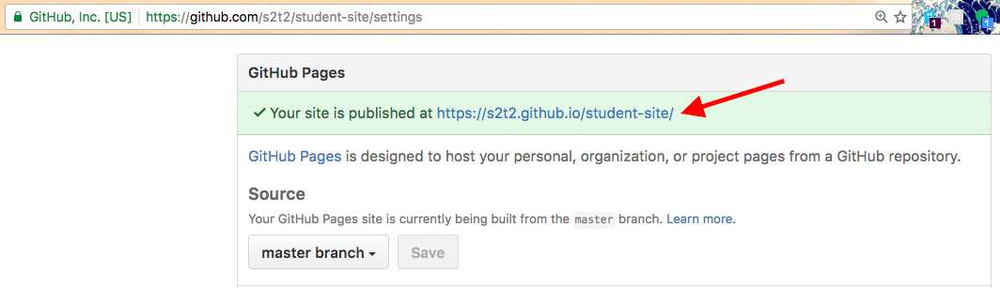

# Fork the Repo

Leverage an existing open source website to publish your own.

## Objectives

  1. Develop basic familiarity with software version control (Git), including the ability to "fork" a repository and "commit" changes using the GitHub online platform.
  * Demonstrate the ability to edit with syntactical precision an html document using a web-based text editor.
  * Gain exposure to an example static website, noting its repository file structure.

## Prerequisites

  1. Install a [modern web browser](/README.md#browser), if necessary.
  * Register on [GitHub](https://github.com/), if necessary.

## Instructions

### Fork

Sign in to GitHub and navigate to the [prof-rossetti/student-site](https://github.com/prof-rossetti/student-site) repository. This repository contains an `index.html` page and other files comprising a basic static website.

Click the "fork" button to copy the repository to your own user or organization of choice.

### Configure Hosting

[GitHub Pages](https://pages.github.com/) offers a free mechanism for hosting your website, but must first be configured.

Navigate to your forked repository, if necessary.

> Note: the repository URL structure should resemble https://github.com/USERNAME/student-site, where USERNAME is your own GitHub username.

Navigate to your repository's "Settings" menu and scroll down to find the section called "GitHub Pages".

Ensure that the "master" branch is selected from the drop-down, and make sure to save your selection, if necessary.

### Tweak Content

Navigate to the repository's `about.html` file, and click the "edit" button to reveal a web-based text editor.

Change some of the page's content, such as the student's name, changing "Sammy Student" to your own name.

### Publish

When you are satisfied with your changes, scroll to the bottom of the page and click the "commit" button to save them. Ensure your commit will trigger a GitHub Pages update by commiting directly to the branch you configured in the "GitHub Pages" settings, which in this case is the "master" branch.

### Visit

Navigate back to the "GitHub Pages" section of your repository's "Settings" menu, and note the URL of your hosted website.

> Note: the website URL structure should resemble https://USERNAME.github.io/student-site/, where USERNAME is your own GitHub username.

Visit that URL, and navigate to the "about" page, where you should see your changes.

Congratulations, you've published a website!
