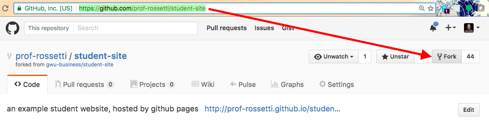
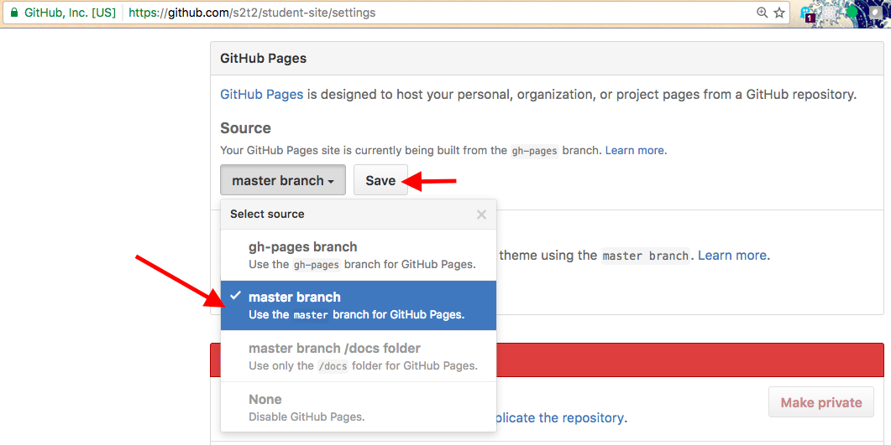
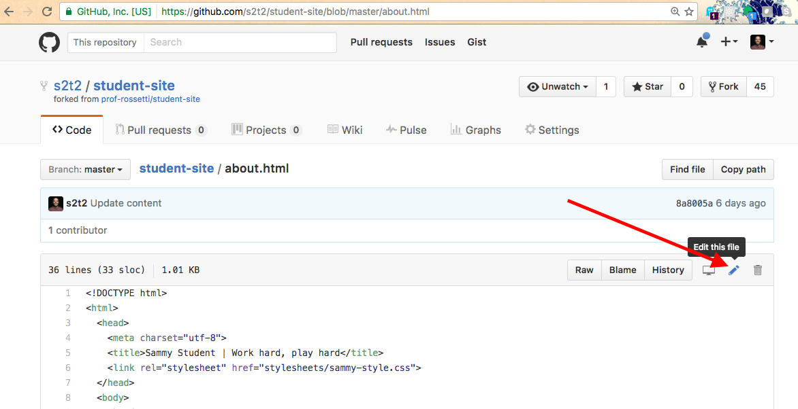

# Open Source (Fork the Repo)

Leverage an existing open source website to publish your own.

> Note: your website content will be available to the public.

## Objectives

  1. Develop a familiarity with open source software, software version control, and website hosting.
  * Gain exposure to a basic website, noting its directory structure and observing HTML document structures and content.
  * Obtain a foundation upon which to develop and publish your own personal website, for free.
  * Leverage technology as an outlet for creativity.

## Prerequisites

  * Register on [GitHub](https://github.com/), unless you already have an account. When registering for the first time, you must confirm your email address - check your inbox for a confirmation email and click the link.

## Instructions

### Fork

Sign in to GitHub and navigate to the [prof-rossetti/student-site](https://github.com/prof-rossetti/student-site) repository. This repository contains an `index.html` page and other files comprising a basic static website.

Click the "fork" button to copy the repository to your own user or organization of choice.

### Configure Hosting

[GitHub Pages](https://pages.github.com/) offers a free mechanism for hosting your website, but must first be configured.

Navigate to your forked repository, if necessary.

> Note: the repository URL structure should resemble https://github.com/USERNAME/student-site, where USERNAME is your own GitHub username.

Navigate to your repository's "Settings" menu and scroll down to find the section called "GitHub Pages".

Ensure that the "master" branch is selected from the drop-down, and make sure to save your selection, if necessary.

### Tweak Content

Navigate to the repository's `about.html` file, and click the "edit" button to reveal a web-based text editor.

Change some of the page's content, such as the student's name, changing "Sammy Student" to your own name.

### Publish

When you are satisfied with your changes, scroll to the bottom of the page and click the "commit" button to save them. Ensure your commit will trigger a GitHub Pages update by commiting directly to the branch you configured in the "GitHub Pages" settings, which in this case is the "master" branch.

### Visit

Navigate back to the "GitHub Pages" section of your repository's "Settings" menu, and note the URL of your hosted website.

> Note: the website URL structure should resemble https://USERNAME.github.io/student-site/, where USERNAME is your own GitHub username.

Visit that URL, and navigate to the "about" page, where you should see your changes.

Congratulations, you've published a website! You are encouraged to further edit its content, structure, and style to reflect your own personality and suit your own purposes.
