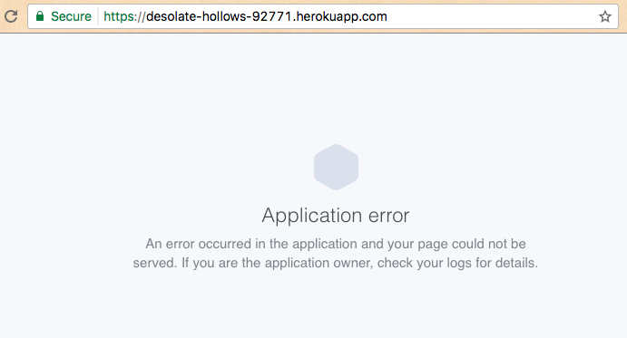

# CRUD Application Checkpoint V: Application Deployment

Deploy your web application to a production environment where it is publicly accessible on the Internet.

Adapted from [source](http://data-creative.info/process-documentation/2016/04/09/node-for-rails-developers-part-2-node-and-express/).

## Objectives

  1. Practice creating, managing, and deploying Heroku application servers.
  2. Configure an Express web application to run on a "production environment" Heroku application server.

## Prerequisites

  1. [CRUD Application Checkpoint IV: Application Generation](/projects/crud-application/checkpoints/app-generation/checkpoint.md)
  2. [Servers Overview](/notes/computer-networks/servers.md)
  3. [Heroku Overview](/notes/heroku/notes.md)

## Instructions

Ensure you have initialized a Git repository in the root directory of your Express application, committed your changes, and pushed them to a remote repository.

Create a new Heroku application inside the root directory of your Express application:

```` sh
cd my_app/ # navigate to the root directory of your Express application unless you're already there
heroku create # initialize a new Heroku application in this directory
````

Observe this creates a new Git remote repository called "heroku" and you should now see two remote repositories ("origin" representing the source code on GitHub, and "heroku" representing the source code on the production Heroku server):

```` sh
git remote
git remote -v
````

> Further exploration: If you tried to deploy your application to production now (`git push heroku master`) and visited the production application in a browser (`heroku open`), you'd end up seeing an error message. When you'd check the server logs (`heroku logs`), you'd see the server complaining about an inability to run `nodemon`. We were using `nodemon` to run our development web server, but in production we should use `node` to run the web server.
>
> 
>
> So we have to be more specific about how the server should run our application.

Configure the Express application to run on a Heroku server by adding a new `Procfile` file to the root project directory which contains the following contents:

```` sh
web: node ./bin/www
````

Commit your changes, push them to a remote repository, then deploy the application source code to a Heroku application server:

```` sh
git commit -am "Configuring app to run on Heroku"
git push origin master
git push heroku master
heroku open # finally, visit the production application in a browser
````

Congratulations, you have just "pushed to production" and you gained some serious coder cred.
