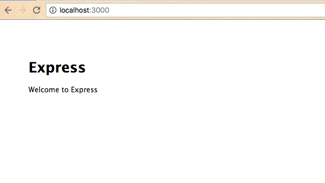

# CRUD Application Checkpoint IV: Application Generation

Generate a new Express application, configure it, and use a local web server to preview it in a browser.

Adapted from [source](http://data-creative.info/process-documentation/2016/04/09/node-for-rails-developers-part-2-node-and-express/).

## Objectives

  1. Practice installing and using third-party Node.js packages.
  2. Gain exposure to using a third-party package to initialize a new Express application.
  3. Gain familiarity with the directory structure and file contents of an Express application.
  4. Practice running Node.js scripts from within an NPM project.

## Prerequisites

  1. [Server-side JavaScript Exercise](/exercises/server-side-javascript/exercise.md)
  2. [Express Overview](/notes/javascript/express.md)

## Instructions

### Install Express

Use NPM to install a module called the [Express Generator](http://expressjs.com/en/starter/generator.html). This package includes the Express package, as well as a command-line utility called the Express Generator for generating new Express applications.

Install Express Generator globally:

```` sh
npm install express-generator -g
````

> Reminder: passing the `-g` flag denotes a global installation. Global installations generally allow the module to be invoked from the command line, even outside of a NPM project directory.

### Generate an Express Application

Use the Express Generator to generate a skeleton directory structure for a new Express application, and name it something like "my_app":

```` sh
express my_app --view=ejs
````

> Note: the `--view=ejs` option specifies our choice to use EJS as a view template engine instead of the default template engine, Jade. If you don't know what this means, don't worry about it!

This command should create a directory named `my_app/` which contains the following files:

    bin/www
    public/javascripts
    public/images
    public/stylesheets
    public/stylesheets/style.css
    routes/index.js
    routes/users.js
    views/index.ejs
    views/error.ejs
    app.js
    package.json

Don't worry if you're unfamiliar with the location and purpose of each of these files. We will examine each at the appropriate time.

Do take a moment to observe presence of the `package.json` file, which indicates this project is an NPM project. The project's root directory doesn't contain an `index.js` file, but which file do you think is the main entry-point into this NPM project?

### Install Package Dependencies

Install package dependencies:

```` sh
cd my_app
npm install
````

If you are using version control, remember to add a `node_modules/` line to your `.gitignore` file.

### Run a Local Web Server

Run the default development web server:

```` sh
# Mac Terminal:
DEBUG=my_app:* npm start

# Windows Command Prompt:
set DEBUG=myapp:* & npm start
````

You should now be able to visit the application's home page in your browser at `localhost:3000`. Go check it out:



After demonstrating the ability to view the application locally in a browser, stop the web server by typing `ctrl-c`.

Nice job. We would otherwise be done with this checkpoint, but before we go any further, let's install a different web server.

### Upgrade Local Web Server

One shortcoming of the default web server is that it requires us to restart the server each time we make a change to one of our application's files. During development, this happens a lot, so we'll want to upgrade our development web server. We can use a module called [Nodemon](https://nodemon.io/), which will automatically detect file changes and obviate our need to take manual action.

Install Nodemon globally:

```` sh
npm install nodemon -g
````

Modify the web server start script in `package.json` to invoke `nodemon` instead of `node` when running the server:

```` js
// package.json
...
  "scripts": {
    "start": "nodemon ./bin/www", // was: "start": "node ./bin/www",
  },
...
````

Take this opportunity to take a quick look at the `bin/www` file. The code in this file defines the web server which runs on port 3000 the application logic defined in `app.js`.

Restart the web server:

```` sh
# Mac Terminal:
DEBUG=my_app:* npm start

# Windows Command Prompt:
set DEBUG=myapp:* & npm start
````


Congratulations. You've just created a new web application and viewed it locally in a browser. Commit your changes to version control. The next step will be to setup the application's navigational structure.
