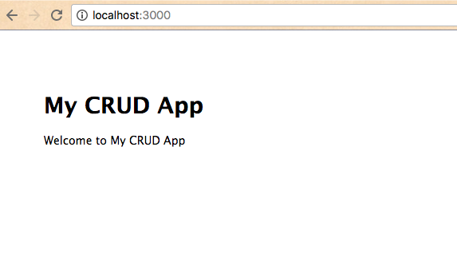
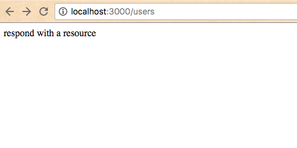

# CRUD Application Checkpoint V: Application Navigation and Routing

Establish the routing and navigational structure of your application.

## Objectives

  1. Gain familiarity with Express application navigation, including routers and views.

## Prerequisites

  1. [CRUD Application Checkpoint IV: Application Generation](/projects/crud-application/checkpoints/app-generation/checkpoint.md)

## Instructions

### Routing

Notice in the `app.js` file the inclusion of two local modules:

    var index = require('./routes/index');
    var users = require('./routes/users');

These modules define the application's routing logic. Examine the `routes/index.js` file:

```` js
var express = require('express');
var router = express.Router();

/* GET home page. */
router.get('/', function(req, res, next) {
  res.render('index', { title: 'Express' });
});

module.exports = router;
````

There's a lot going on in so few lines of code, so let me provide some commentary:

```` js
var express = require('express'); // loads the "express" module from the node_modules directory
var router = express.Router(); // initializes a new router object (see https://expressjs.com/en/api.html#router for documentation)

/* GET home page. */
// this .get() function enables the application's web server to handle a GET request
// ... to the url path indicated by the first parameter, in this case '/'.
// ... The second parameter is a function to be invoked when a GET request is made at the specified url path.
// ... The callback function's first two parameters represent a request object and a response object.
router.get('/', function(req, res, next) {
  res.render('index', { title: 'Express' }); // calls the .render() function on the response object ...
  // ... instructing the response to render a "view" file indicated by the first parameter ...
  // ... and pass into it some custom data specified in the second parameter, which is an object.
});

module.exports = router; // enables other modules to load this one, and specifies the variable to load when this module is required
````

You don't have to internalize all of this at the moment. But what you can do is tweak the value of the `title` string, changing it from `'Express'` to something like 'My CRUD App'. Refresh the browser and see what happens:



### Viewing

Congratulations, you have just passed some custom data from the `routes/index.js` file into the view file defined at `views/index.ejs`. Examine the `views.ejs` file to see how that data is getting used.

```` html
<!DOCTYPE html>
<html>
  <head>
    <title><%= title %></title>
    <link rel='stylesheet' href='/stylesheets/style.css' />
  </head>
  <body>
    <h1><%= title %></h1>
    <p>Welcome to <%= title %></p>
  </body>
</html>
````

It comes as no surprise that this view file is making use of the `title` variable that was passed to it. In the same way we can pass static data from our routers to our views, we can pass resources to fulfill the promise of our CRUD application.

Before we move on, take a moment to notice this "view" file. It looks a lot like HTML. It is HTML. Well, most of it. All of the code except for a few blocks which are encapsulated inside these special tags: `<%= ... %>`. This syntax is part of the magic of the EJS view engine that we configured when we first initialized our application. It executes any JavaScript code inside these tags and outputs the resulting HTML. Super cool, right? It's clear to see why EJS stands for "Embedded JavaScript."


### More on Routing

Navigate to http://localhost:3000/users in your browser. Notice there is also content on that page that is getting passed from the router defined in `routes/users.js`. But this time, there is no corresponding view file - the router is passing data directly to the browser via the `send()` function.



Good to know. Instead of a message string, try passing a JSON object to the `res.send()` function, like `res.send({a:1, b:2, c:3})`. Then refresh the page to see what happens.

Finally, add a link from the index page to the users page. Hint: it is as simple as editing the HTML code in the `views/index.ejs` file.

Commit your project to version control. You are now ready to modify the routing logic of this application.
