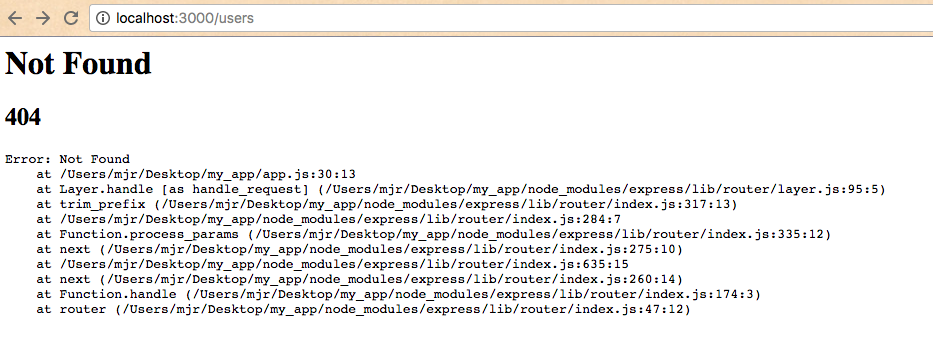

# CRUD Application Checkpoint V: Application Navigation

Establish the routing and navigational structure of your application.

## Objectives

  1. Gain familiarity with Express application navigation, including routers and views.
  2. Practice developing the structure of a web application.

## Prerequisites

  1. [CRUD Application Checkpoint IV: Application Generation](/projects/crud-application/checkpoints/app-generation/checkpoint.md)

## Instructions

### Routing

Notice in the `app.js` file the inclusion of two local modules:

    var index = require('./routes/index');
    var users = require('./routes/users');

These modules define the application's routing logic. Examine the `routes/index.js` file:

```` js
var express = require('express');
var router = express.Router();

/* GET home page. */
router.get('/', function(req, res, next) {
  res.render('index', { title: 'Express' });
});

module.exports = router;
````

There's a lot going on in so few lines of code, so let me provide some commentary:

```` js
var express = require('express'); // loads the "express" module from the node_modules directory
var router = express.Router(); // initializes a new router object (see https://expressjs.com/en/api.html#router for documentation)

/* GET home page. */
// this .get() function enables the application's web server to handle a GET request
// ... to the url path indicated by the first parameter, in this case '/'.
// ... The second parameter is a function to be invoked when a GET request is made at the specified url path.
// ... The callback function's first two parameters represent a request object and a response object.
router.get('/', function(req, res, next) {
  res.render('index', { title: 'Express' }); // calls the .render() function on the response object ...
  // ... instructing the response to render a "view" file indicated by the first parameter ...
  // ... and pass into it some custom data specified in the second parameter, which is an object.
});

module.exports = router; // enables other modules to load this one, and specifies the variable to load when this module is required
````

You don't have to internalize all of this at the moment. But what you can do is tweak the value of the `title` string, changing it from `'Express'` to something like 'My CRUD App'. Refresh the browser and see what happens:


### Viewing

Congratulations, you have just passed some custom data from the `routes/index.js` file into the view file defined at `views/index.ejs`. Examine the `views.ejs` file to see how that data is getting used.

```` html
<!DOCTYPE html>
<html>
  <head>
    <title><%= title %></title>
    <link rel='stylesheet' href='/stylesheets/style.css' />
  </head>
  <body>
    <h1><%= title %></h1>
    <p>Welcome to <%= title %></p>
  </body>
</html>
````

It comes as no surprise that this view file is making use of the `title` variable that was passed to it. In the same way we can pass static data from our routers to our views, we can pass resources to fulfill the promise of our CRUD application.

Before we move on, take a moment to notice this "view" file. It looks a lot like HTML. It is HTML. Well, most of it. All of the code except for a few blocks which are encapsulated inside these special tags: `<%= ... %>`. This syntax is part of the magic of the EJS view engine that we configured when we first initialized our application. It executes any JavaScript code inside these tags and outputs the resulting HTML. Super cool, right? It's clear to see why EJS stands for "Embedded JavaScript."

#### More Views

Navigate to http://localhost:3000/users in your browser. Notice there is also content on that page that is getting passed from the router defined in `routes/users.js`. But this time, there is no corresponding view file - the router is actually passing the page contents directly to the browser via the `send()` function.


Good to know. Let's try responding with a JSON object by modifying the parameter value of the `send()` function:

```` js
// TODO
````

If you're curious, try to add a link from the index page to the users page. Hint: it is as simple as editing the HTML code in the `views/index.ejs` file.

Then feel free to delete the `routes/users.js` file because we don't need it. If you do, also remove, or comment-out the lines `var users = require('./routes/users');` and `app.use('/users', users);` from the `app.js` file. Then restart the web server and notice what happens when you try to navigate back to the users page:



### New Views

You can add new routers and views in the opposite manner that you just deleted the last one. First, make sure to add a line like `var users = require('./routes/users');` near the top of the `app.js` file. This loads the router logic and makes it available for further use by the application. Next, make sure to add a line like `app.use('/users', users);` in the appropriate part of `app.js` file. This associates the router logic with a given URL path (I'd recommend always anchoring your routers to the root url "/"). Finally, create a new router file and optionally a new view file, and configure them to match the prior examples.

Your mission now is to adapt the views and the routing of this application to match the structure and style you implemented in the previous [structure](/projects/crud-application/checkpoints/structure/checkpoint.md) and [style](/projects/crud-application/checkpoints/style/checkpoint.md) checkpoint exercises. This may take a considerable amount of time unless your past self has prepared you with the code you need, in which case you get to do a lot of copy and pasting. See https://prof-rossetti.github.io/crud-app-beginnings/robots for a working demo:


At this time, you should only focus on a subset of these views to include the robots index page and the robot show page. We will create the rest of the pages during a later checkpoint. For the index page and the show page, first start by passing static hard-coded data from the router to the view. After you configure the routers and views to display static data, commit your code, then attempt to issue GET requests to fetch data from the provided API and pass that dynamic data back to the view. If you are able to configure your routers to request data from the API and display the results on the page, you have succeeded in your mission!

#### Index Page

TBA - detailed instructions

#### Show Page

TBA - detailed instructions


> ### Further Exploration
> Can you DRY-up much of the shared code that exists in your views? Focus on the shared navigation and footer content. Hint: you can use "view partials" or "templates" by abstracting your shared HTML content into a separate file and including it via an EJS snippet like `<% include path/to/template %>`. See https://github.com/tj/ejs#includes for documentation.
>
> Congrats, you are making life easier on yourself and preventing future effort and error by DRY-ing up much of that shared HTML code.
