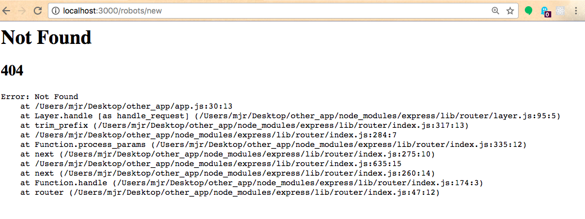
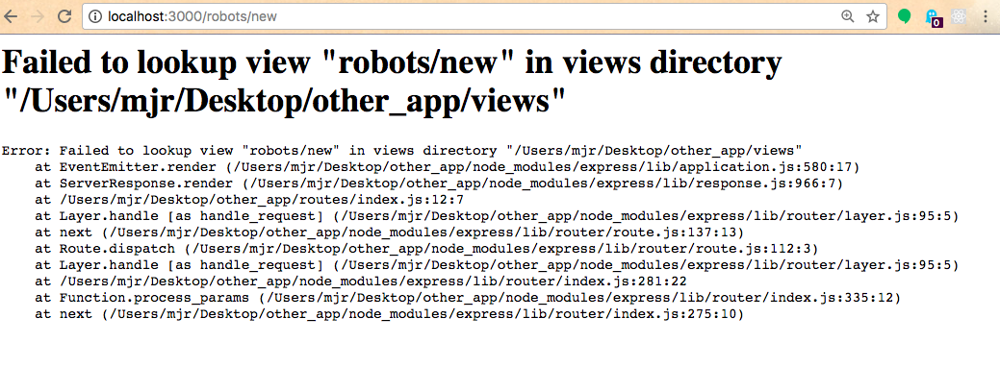
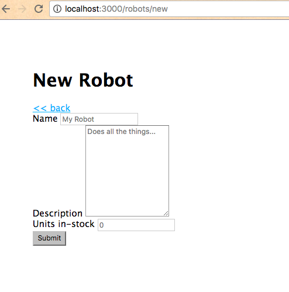
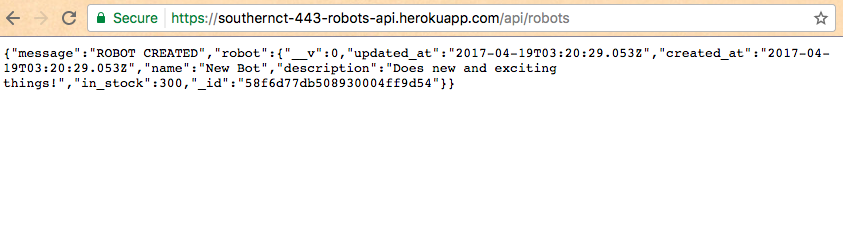

# CRUD Operations - Creating Records

## Instructions

Modify the application's user interface to include a button that links to a page that has a form on it. Configure the form such that when submitted, it makes a POST request to the proper API endpoint to create a new robot resource.

### View

Add a "New" button somewhere on the robots index page (`views/robots/index.ejs`):

```` js
<a href="/robots/new">
  <button>+ New Robot</button>
</a>
````

It should link to the New Robot page (`/robots/new`).

Visit the index page in a browser, then click the "New" button, and notice a 404 (Not Found) error:



It's because we haven't yet configured a router to handle requests to this URL path. Let's do that now.

### Router

Update the robots router (`/routes/robots.js`) to include the following logic:

```` js
// ...

/* NEW */

router.get('/robots/new', function(req, res, next) { // handle GET requests to the robots/new URL path
  res.render('robots/new', { // render the robots/new.ejs view
    title: "New Robot"
  })
})

// ...
````

Navigate back to the index page, then click the "New" button again. You should see an error like this:




It's because we are telling the router to render a view that doesn't exist. Let's create it now.

### New Robot Page

Create a new view called `/views/robots/new.ejs` and add an HTML form:

```` html
<!DOCTYPE html>
<html>
  <head>
    <title><%= title %></title>
    <link rel='stylesheet' href='/stylesheets/style.css' />
  </head>
  <body>
    <h1><%= title %></h1>

    <a href="/robots"><%= "<< back" %></a>

    <form id="new-robot-form" action="https://southernct-443-robots-api.herokuapp.com/api/robots" method="POST">
      <label for="name">Name</label>
      <input id="name" name="name" type="text" placeholder="My Robot">
      <br>

      <label for="description">Description</label>
      <textarea id="description" name="description" rows="10" placeholder="Does all the things..."></textarea>
      <br>

      <label for="in-stock">Units in-stock</label>
      <input id="in-stock" name="in_stock" type="number" placeholder="0">
      <br>

      <button id="submit" type="submit">Submit</button>
    </form>

    <script src="https://code.jquery.com/jquery-3.2.1.min.js"></script><!-- ONLY NECESSARY IF YOU'RE SENDING REQUESTS VIA jQUERY -->
    <script src="https://d3js.org/d3.v4.min.js"></script><!-- ONLY NECESSARY IF YOU'RE SENDING REQUESTS VIA D3 -->
    <script type="text/javascript">

      // TODO: ADD JAVASCRIPT HERE TO SEND DATA TO THE WEB SERVICE WHEN THE FORM SUBMIT BUTTON IS PRESSED

    </script>
  </body>
</html>
````

Refresh the page. You should now see a form:



Congratulations.

If you were to fill out the form and click the "Submit" button, you'd submit a successful request to the web service, but you'd be redirected to the URL of a JSON response returned by the web service:



Not the best user experience. Let's fix it by overwriting the default behavior of this form submit button. We will make an AJAX request and redirect the user to the robots index page after the request has been fulfilled. Inside the `<script>` at the bottom of the page, use the following code:

```` js
var inputName = document.getElementById("name")
var inputDescription = document.getElementById("description")
var inputQuantityInStock = document.getElementById("in-stock")
var submitButton = document.getElementById("submit")

submitButton.addEventListener("click", submitForm, false)

function submitForm(event) {
  event.preventDefault() // important to leave this here because it prevents duplicate form submission!

  var requestUrl = "https://southernct-443-robots-api.herokuapp.com/api/robots"

  var formData = {name: inputName.value, description: inputDescription.value, in_stock: inputQuantityInStock.value} // read input values
  console.log("POSTING", formData, "TO", requestUrl)

  //
  // Using fetch
  //

  //var requestOptions = {
  //  method: "POST",
  //  headers: {'Accept':'application/json', 'Content-Type':'application/json'},
  //  body: JSON.stringify(formData)
  //}

  //fetch(requestUrl, requestOptions).then(function(response) {
  //  if (response.ok) {
  //    response.json().then(function(json){
  //      window.location = '/robots' // REDIRECT USER TO ROBOTS INDEX PAGE
  //    })
  //  } else {
  //    alert("OOPS THERE WAS AN ERROR") // FURTHER EXPLORATION: send a more specific error message
  //  }
  //})

  //
  // Using jQuery
  //

  //$.post(requestUrl, formData)
  //  .done(function(data, textStatus, xhr) {
  //    window.location = '/robots' // REDIRECT USER TO ROBOTS INDEX PAGE
  //  })
  //  .fail(function(xhr, textStatus, errorThrown){
  //    alert("OOPS THERE WAS AN ERROR") // FURTHER EXPLORATION: send a more specific error message
  //  })

  //
  // Using D3
  //

  //d3.request(requestUrl)
  //  .header("Accept", "application/json")
  //  .header("Content-Type", "application/json")
  //  .on("error", function(error) {
  //    alert("OOPS THERE WAS AN ERROR") // FURTHER EXPLORATION: send a more specific error message
  //  })
  //  .on("load", function(xhr) {
  //    window.location = '/robots' // REDIRECT USER TO ROBOTS INDEX PAGE
  //  })
  //  .send("POST", JSON.stringify(formData))

}
````

Refresh the page, fill out the form, and click the "Submit" button. You should now be redirected to the robots index page, where you see the new robot you created in the list. Nice job. This is a better user experience.

Feel satisfied that your application is now sending POST requests to the web service and handling the resulting responses. This is perhaps one of the hardest parts of the CRUD Application project. And you've mastered it.

> ## Further Exploration
>
> Try to submit the form without filling in all required fields, and you will see an error has occurred. Drop a `debugger` statement inside the error-handling part of your AJAX request function and you'll be able to inspect the error response sent by the web service. Parse the error response to find a more specific message, then pass that information along in an alert message to the user to provide a better user experience.
