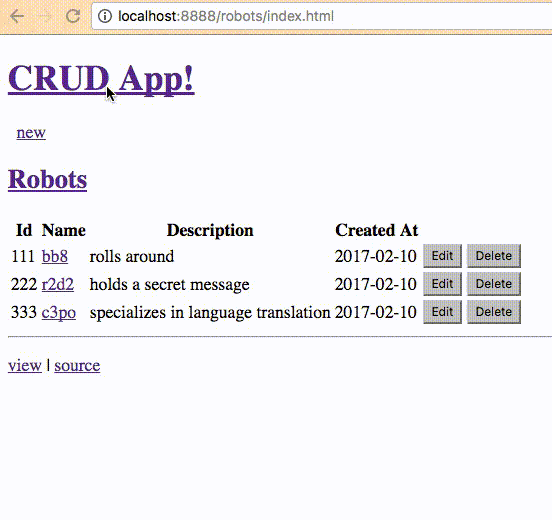
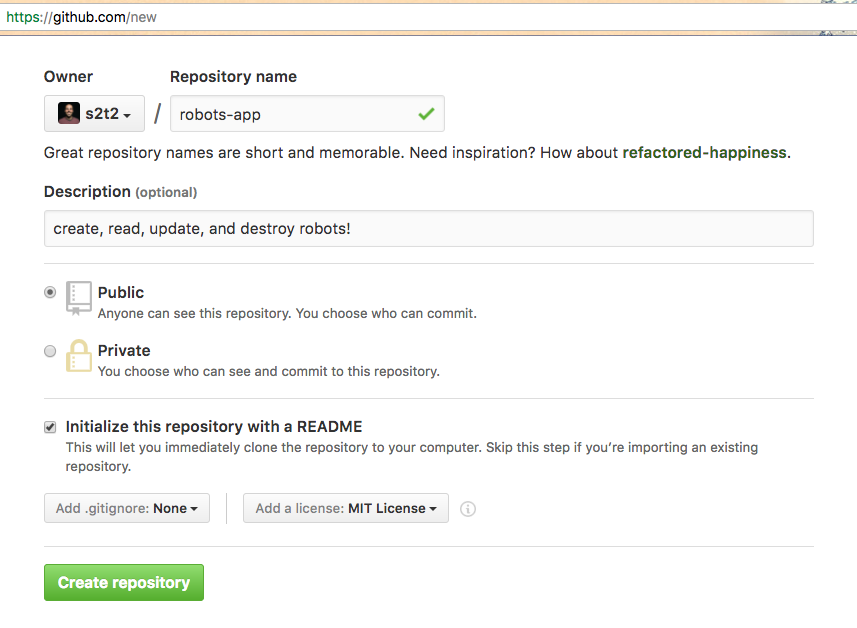
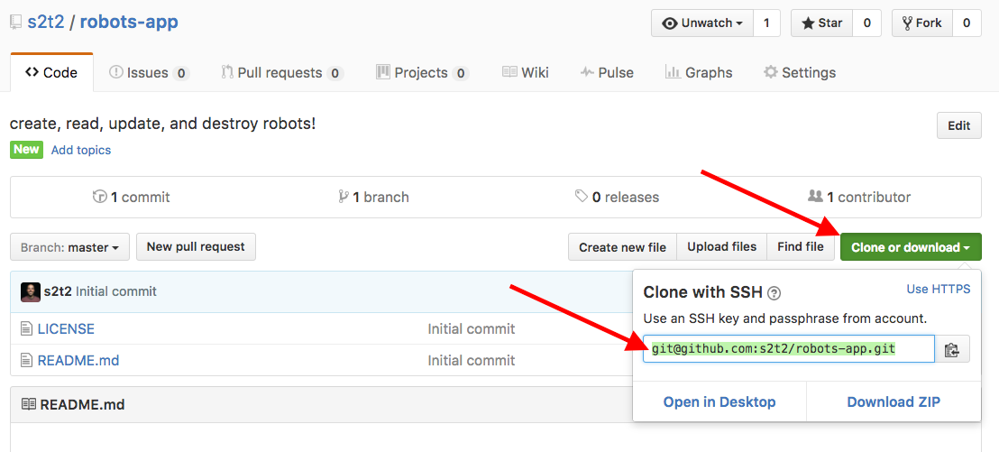

# CRUD Application Checkpoint I: Structure

Establish the preliminary structure of your CRUD web application.

## Objectives

  * Practice HTML.
  * Practice software version control.
  * Practice website hosting.

## Prerequisites

  1. [Personal Website Checkpoint I: Structure](/projects/personal-website/checkpoints/structure/checkpoint.md)

## Instructions

Create a new website that mimics the structure of https://prof-rossetti.github.io/crud-app-beginnings/robots. Don't worry about the home page of that site. Just focus on the `/robots` pages.

Also ignore that application's style and interactive features. See detailed instructions, below, to get a better sense of exercise scope. You've met the expectations of this checkpoint if your app looks something like this:



### Configure Remote Repository

Create a new public repository on GitHub. Name it "robots-app" and describe as "create, read, update, and destroy robots!" Initialize it with a README, and choose the MIT license. Finally, click "Create repository".



Use your Git client to copy the repository down to your computer for local development.

You may need to reference its remote address. Find the remote address on the repository's home page.



If you are using the git CLI:

```` sh
git clone REMOTE_ADDRESS
````

### Develop Locally

#### Edit HTML

After copying the repository to your local machine, create the following files in your repository's root directory:

  + `index.html`
  + `bb8.html`
  + `c3po.html`
  + `r2d2.html`
  + `new.html`

Populate each page with basic HTML file structure, including a consistent header and footer. Ensure the header of each page contains a link back to the `index.html`. Ensure the footer of each page contains a link to your source code (GitHub repository).

##### List

In the `index.html` file, insert a `table` with a header row and one row per robot.

Each row should contain the following columns:

  + Id
  + Name
  + Description
  + Created At
  + Updated At

The contents of each row should describe that row's robot. The name of each robot should link to its dedicated "show page" (i.e. the row labeled "c3po" should contain a link to `c3po.html`).

Commit your changes.

##### Show

For each robot's individual "show page", create either a table or list or simple paragraph text displaying the robot's information:

  + Id
  + Name
  + Description
  + Created At
  + Updated At

Commit your changes.

##### New

Somewhere on the `index.html` page, insert a link to the `new.html` file.

Inside the `new.html` file, insert a `form` element. The form should contain the following elements:

  + text `input` accompanied by a `label` called "Name"
  + `textarea` input accompanied by a `label` called "Description"
  + `button` called "Submit"

If you're interested, also add to the form:

  + a `select` element with multiple nested `option` elements
  + a group of "radio" type `input` elements inside their own `div`
  + a "checkbox" type `input` element

Don't worry about styling the form or trying to make it work. We will take care of these tasks during later checkpoints.

Commit your changes and push them to your remote repository.

Nice job!
