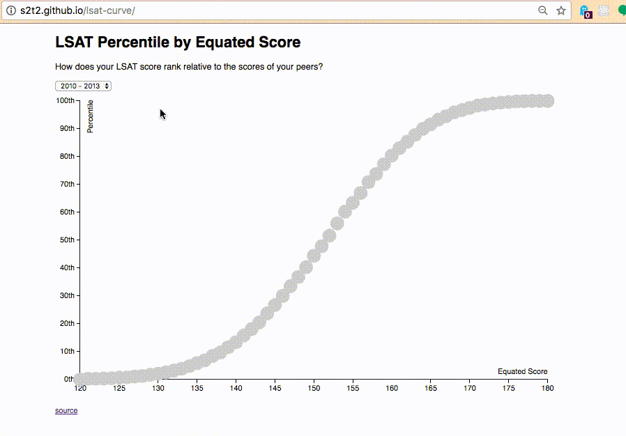
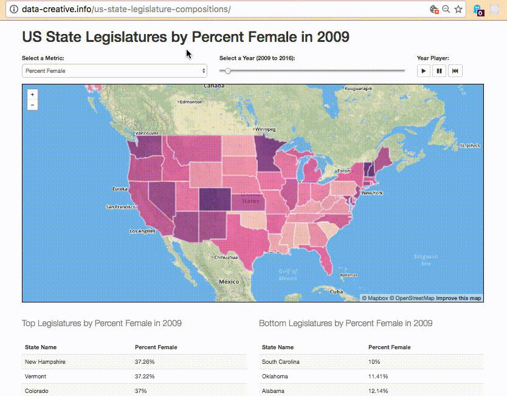

# Data Visualization Project

Plan, design, and develop a one-page website which visualizes an open dataset. Your data visualization can take the form of a chart, graph, map, or other related representation. It should tell a story about the data in a manner which allows the viewer to draw a conclusion or learn something.

## Instructions

### Plan

#### Choose an Open Dataset

Your data visualization must exist for the purpose of representing information. First, search the Internet to find a dataset which resonates with you. Try looking in open data portals such as:

  + http://databank.worldbank.org/data/home.aspx
  + http://data.un.org/
  + https://www.data.gov/
  + https://www.census.gov/
  + https://www.healthdata.gov/search/type/dataset
  + http://permitdata.org/#samples
  + https://data.ct.gov/
  + https://data.hartford.gov/
  + http://ctdata.org/
  + http://www.ctdatahaven.org/data-resources

Alternatively, you may choose to use data that comes from an API or other web service. If you use data from an API, you are responsible for figuring out how to authenticate to that service, but feel free to ask the professor for authentication help. Relevant example APIs include but are in no way limited to:

  + https://developer.yahoo.com/weather/
  + https://darksky.net/dev/docs/forecast
  + https://api.citybik.es/v2/
  + https://developer.nytimes.com/

Regardless of the source, your chosen dataset will likely exist in JSON, CSV, or XML format. If you choose to include a copy of the dataset in your repository, put the file(s) in a directory called `/data`. For example: `data/heart-surgeries.json`.

Note: You should [avoid manually manipulating the dataset](http://data-creative.info/best-practices/2015/09/24/dont-touch-the-data/) except in trivial ways. If your dataset requires significant transformation, that process should be done with a script or other automated repeatable process.

After you have selected a dataset and observed its structure and content, create a document in your project repository called `DATA.md` to objectively describe the dataset contents in English and provide a link to the dataset's source. Make sure to include definitions of any words or terms that are not self-explanatory (i.e. a "data dictionary").

### Design

After familiarizing yourself with your chosen dataset, design a data visualization by producing drawings or other illustrative representations. You may choose to use pencil and paper, whiteboard, digital design tools, etc. If your design documents don't start in digital format, take a picture or otherwise scan them into digital format. Include all design documents in your project repository in a directory called `/design`.

### Implement

Once you are satisfied with your initial design, begin developing your data visualization.

Continue developing your data visualization until you are satisfied with its representation of your original design and its ability to meet its objectives (i.e. to tell a story).

Ensure the data visualization is hosted and available for public consumption on the Internet.

## Submission Instructions

When your data visualization is ready for evaluation, add its identifying information, including your GitHub username, a link to your site's repository, and a link to your hosted site, to the [submissions list](submissions.md). Use the following workflow to accomplish this:

  1. Fork [this repository](https://github.com/SCSU-CSC-Department/201701-csc-443-01/) to your own account.
  2. Edit the submissions list in your forked repo via the online editor, or by downloading your forked repo, making local commits, and pushing them back up to GitHub.
  3. Submit a Pull Request for your changes to be merged into this repo.

> NOTE: If you would prefer for any reason to submit your work privately, you may alternatively send the professor your links via email or Slack DM. Your project will still be evaluated, and peer-evaluated, but its identifying information will not be publicly accessible as part of this course repository.

Also be prepared to deliver a 5-10 minute presentation to demonstrate usage of your website and describe your planning and design process, as desired.

## Evaluation Criteria

Your data visualization will be evaluated according to the following criteria:

criteria | weight
--- | ---
Planning and Design | 25%
Implementation | 50%
Peer Evaluation | 25%

Partial credit may be given to highlight areas of improvement.

### Planning and Design Evaluation

Your data visualization planning and design documents will be evaluated for presence, clarity, and thoroughness. This includes checking for presence of a data source attribution link, and a short description of the dataset.

### Implementation Evaluation

Your data visualization implementation will be evaluated based on its demonstrated ability to meet all of the following criteria:

  1. Is hosted on the Internet and publicly accessible.
  2. Contains clear, concise, and engaging content free of typographical or grammatical mistakes.
  3. Creative and usable design free of usability quirks or bugs.
  4. Contains exactly one HTML page: `index.html`
  5. Contains **minimal HTML markup** within the `index.html` - at most three to five to maybe ten elements (not a hard rule, just know the purpose of this project is to use JavaScript to manipulate the DOM instead of hard-coding HTML elements).
  6. Contains at least one internal `<script>` or external JavaScript script.
  7. Demonstrates an ability to use JavaScript to manipulate the DOM.
  8. Contains at least one input element (e.g. `button`, `select`, etc.) which can be used to update the visual display **without refreshing the page**.

#### Peer Evaluation

All members of the learning community, including the professor, will evaluate an assigned list of five submitted data visualizations, and will assign each peer project a score from 1 to 10. A weighted average of these individual scores will produce the overall Peer Evaluation Score.
