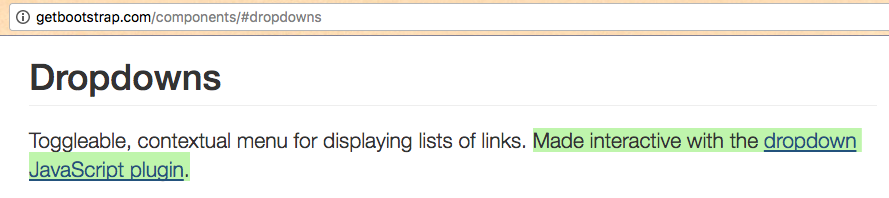
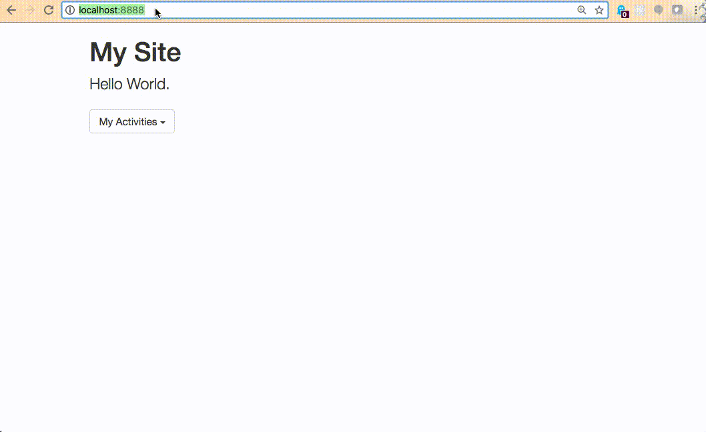
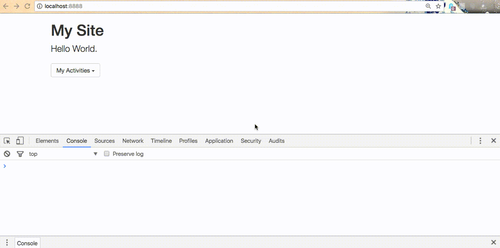

# Personal Website Checkpoint III: Interactivity

Using the Twitter Bootstrap front-end framework, configure interactive features as necessary to produce desired website functionality.

## Objectives

  1. Gain exposure to JavaScript within the context of Twitter Bootstrap.
  * Gain exposure to jQuery within the context of Twitter Bootstrap.
  * Configure internal and external JavaScript scripts.
  * Use jQuery and Twitter Bootstrap JavaScript plugins to add interactive features to a web page.

## Prerequisites

  1. [Personal Website Checkpoint II: Style](projects/personal-website/checkpoints/style/checkpoint.md)
  * [CRUD Application Checkpoint II: Style](projects/crud-application/checkpoints/style/checkpoint.md)

## Accompanying Materials

  + [Project Repository](https://github.com/prof-rossetti/bootstrap-js)
  + [Commit History](https://github.com/prof-rossetti/bootstrap-js/commits/master)
  + [Live Demo](https://prof-rossetti.github.io/bootstrap-js/)

## Instructions

In leveraging Twitter Bootstrap to design your personal website, you may have added one or more components which require JavaScript configuration to work properly (e.g. modals, dropdowns, buttons). You'll know if your components require additional configuration because the Twitter Bootstrap documentation will tell you so:



### Setup

Regardless of whether or not this applies to you, you are encouraged to follow along using a new, separate project. Start by adding to it an `index.html` file, and paste in it the following contents:

```` html
<!DOCTYPE html>
<html>
  <head>
    <meta charset="utf-8">
    <title>Bootstrap JS example</title>
    <!-- Use Twitter Bootstrap's CSS Stylesheet ... -->
    <link rel="stylesheet" href="https://maxcdn.bootstrapcdn.com/bootstrap/3.3.7/css/bootstrap.min.css" integrity="sha384-BVYiiSIFeK1dGmJRAkycuHAHRg32OmUcww7on3RYdg4Va+PmSTsz/K68vbdEjh4u" crossorigin="anonymous">
  </head>
  <body>
    <div class="container">
      <h1>My Site</h1>
      <p class="lead">Hello World.</p>


      <!-- adapted from the Twitter Bootstrap documentation on dropdowns ... -->
      <div class="dropdown">
        <button class="btn btn-default dropdown-toggle" type="button" id="dropdownMenu1" data-toggle="dropdown" aria-haspopup="true" aria-expanded="true">
          My Activities
          <span class="caret"></span>
        </button>

        <ul class="dropdown-menu" aria-labelledby="dropdownMenu1">
          <li><a href="activities/gaming.html">Gaming</a></li>
          <li><a href="activities/soccer.html">Soccer</a></li>
        </ul>
      </div>


    </div>
  </body>
</html>
````

Nothing new to see here, except for the `<div class="dropdown">` element and everything inside. This content was adapted from the [Twitter Bootstrap documentation on dropdown components](http://getbootstrap.com/components/#dropdowns).

On this page, you'll notice hyperlinks to two other pages: `activities/gaming.html` and `activities/soccer.html`. Let's create those other pages now, using the following content:

```` html
<!DOCTYPE html>
<html>
  <head>
    <meta charset="utf-8">
    <title>Gaming</title>
  </head>
  <body>
    <h1>A PAGE ABOUT GAMING!</h1>
  </body>
</html>
````

```` html
<!DOCTYPE html>
<html>
  <head>
    <meta charset="utf-8">
    <title>Soccer</title>
  </head>
  <body>
    <h1>A PAGE ABOUT SOCCER!</h1>
  </body>
</html>
````

Start up a local web server to preview your site in a browser.


You'll notice the dropdown button is visible, but not working as desired.

To make it work, we need to first configure it using JavaScript.

Don't worry if JavaScript is new to you. We will cover it in greater depth in subsequent weeks. But for right now, all we need to know how to do is follow the instructions provided at http://getbootstrap.com/javascript/.

The documentation for the [dropdown JavaScript plugin](http://getbootstrap.com/javascript/#dropdowns) provides two different ways to configure the desired functionality. Let's use the "via JavaScript" option.

### Internal Script

In the bottom of your `index.html` file, above the closing `</body>` tag, insert a new `script` tag to define a new internal script. And inside it place the JavaScript snippet provided by the documentation:

````html
<!DOCTYPE html>
<html>
  <head>
    <meta charset="utf-8">
    <title>Bootstrap JS example</title>
    <!-- Use Twitter Bootstrap's CSS Stylesheet ... -->
    <link rel="stylesheet" href="https://maxcdn.bootstrapcdn.com/bootstrap/3.3.7/css/bootstrap.min.css" integrity="sha384-BVYiiSIFeK1dGmJRAkycuHAHRg32OmUcww7on3RYdg4Va+PmSTsz/K68vbdEjh4u" crossorigin="anonymous">
  </head>
  <body>
    <div class="container">
      <h1>My Site</h1>
      <p class="lead">Hello World.</p>

      <!-- adapted from the Twitter Bootstrap documentation on dropdowns ... -->
      <div class="dropdown">
        <button class="btn btn-default dropdown-toggle" type="button" id="dropdownMenu1" data-toggle="dropdown" aria-haspopup="true" aria-expanded="true">
          My Activities
          <span class="caret"></span>
        </button>

        <ul class="dropdown-menu" aria-labelledby="dropdownMenu1">
          <li><a href="activities/gaming.html">Gaming</a></li>
          <li><a href="activities/soccer.html">Soccer</a></li>
        </ul>
      </div>
    </div>

    <!-- Use an internal JavaScript script ... -->
    <script type="text/javascript">

      $('.dropdown-toggle').dropdown() // provided by http://getbootstrap.com/javascript/#via-javascript-1

    </script>
  </body>
</html>
````

> NOTE: Scripts should whenever possible be placed at the bottom of the page, right before the closing `</body>` tag, to prevent slow page-loading. See http://stackoverflow.com/q/5329807 for more information.

> NOTE: Like CSS stylesheets, the order of scripts matters. Be careful.

Let's take a closer look at the JavaScript snippet:

```` js
$('.dropdown-toggle').dropdown()
````

First, there's a random dollar sign (`$`). This makes no sense unless you know that the dollar-sign is a reference provided by a JavaScript library called [jQuery](https://jquery.com/). Basically, any time you use the dollar-sign, you are invoking the jQuery library to use one of its provided features. Among a multitude of other features, jQuery includes the ability to reference certain HTML elements using selectors that resemble CSS selectors, and then do something to/with those elements.

> Reference https://www.w3schools.com/jquery/default.asp as desired for a more in-depth jQuery tutorial.

In the example provided, `$()` invokes the jQuery library to select elements matching the selector specified within the parentheses. In this case, we specify a selector of `'.dropdown-toggle'`, which references all elements with the class of "dropdown-toggle". Reference the HTML to observe that this class is currently applied to the `button` element.

OK, so we know this snippet is using jQuery to select our button, but what is it trying to do with that element? The answer lies in the next part of the snippet which invokes a function named `dropdown()` on the selected elements. You should know this function is provided by Twitter Bootstrap's "dropdown.js" plugin.

Check back in your browser to see if the dropdown button works as desired.

You'll notice no difference in visible functionality, even though we configured the JavaScript as instructed by the documentation. What gives?

I'll give you a hint. When you are working with JavaScript, you can debug it using the browser's same "Inspect" feature that lets you debug HTML and CSS. Let's use the "Console" functionality of our browser's "Inspect" feature to find out what's going on.



In the console, we see the error message, "Uncaught ReferenceError: $ is not defined". It looks like the browser is complaining about not being able to find a definition for `$`. And that's to be expected, because we never loaded the jQuery library, which provides that definition.

### External Scripts

#### jQuery

We need to load the jQuery library in order to use it. We'll use a process very similar to how we loaded Twitter Bootstrap's stylesheets, using a version of the library hosted via a CDN.

Navigate to http://jquery.com/download/#using-jquery-with-a-cdn to find a link to https://code.jquery.com to find a link to instructions on how to load the latest version of jQuery (3.x) in "minified" format. Namely, the documentation instructs you to add the following script tag to your HTML file: `<script src="https://code.jquery.com/jquery-3.1.1.min.js" integrity="sha256-hVVnYaiADRTO2PzUGmuLJr8BLUSjGIZsDYGmIJLv2b8=" crossorigin="anonymous"></script>`. Add it directly above the existing internal script near the bottom of the page:

```` html
<!DOCTYPE html>
<html>
  <head>
    <meta charset="utf-8">
    <title>Bootstrap JS example</title>
    <!-- Use Twitter Bootstrap's CSS Stylesheet ... -->
    <link rel="stylesheet" href="https://maxcdn.bootstrapcdn.com/bootstrap/3.3.7/css/bootstrap.min.css" integrity="sha384-BVYiiSIFeK1dGmJRAkycuHAHRg32OmUcww7on3RYdg4Va+PmSTsz/K68vbdEjh4u" crossorigin="anonymous">
  </head>
  <body>
    <div class="container">
      <h1>My Site</h1>
      <p class="lead">Hello World.</p>

      <!-- adapted from the Twitter Bootstrap documentation on dropdowns ... -->
      <div class="dropdown">
        <button class="btn btn-default dropdown-toggle" type="button" id="dropdownMenu1" data-toggle="dropdown" aria-haspopup="true" aria-expanded="true">
          My Activities
          <span class="caret"></span>
        </button>

        <ul class="dropdown-menu" aria-labelledby="dropdownMenu1">
          <li><a href="activities/gaming.html">Gaming</a></li>
          <li><a href="activities/soccer.html">Soccer</a></li>
        </ul>
      </div>
    </div>

    <!-- Use the jQuery library ... -->
    <script src="https://code.jquery.com/jquery-3.1.1.min.js" integrity="sha256-hVVnYaiADRTO2PzUGmuLJr8BLUSjGIZsDYGmIJLv2b8=" crossorigin="anonymous"></script>

    <!-- Use an internal JavaScript script ... -->
    <script type="text/javascript">

      $('.dropdown-toggle').dropdown()

    </script>
  </body>
</html>
````

Check back in your browser to see if the dropdown button works as desired.

You'll notice it still doesn't work, but we no longer see the "$ is not defined" console message anymore. Partial success!

#### Twitter Bootstrap JavaScript Plugins

Instead, we now see a new error message in the console: "Uncaught TypeError: $(...).dropdown is not a function".

That's ok. The browser is complaining that the `dropdown()` function has not been defined. We know this function is provided by Twitter Bootstrap's "dropdown.js" plugin. [Twitter Bootstrap's JavaScript documentation](http://getbootstrap.com/javascript/#js-individual-compiled) provides information about how to use its JavaScript plugins: *"Plugins can be included individually (using Bootstrap's individual .js files), or all at once (using bootstrap.js or the minified bootstrap.min.js)."*

So we have to load a file called `bootstrap.js` or `bootstrap.min.js` to have access to all the plugins.

Navigate to the http://getbootstrap.com/getting-started/#download-cdn page for instructions on how to load Twitter Bootstrap's JavaScript plugins. The process is similar to the process of loading the jQuery library:

```` html
<!DOCTYPE html>
<html>
  <head>
    <meta charset="utf-8">
    <title>Bootstrap JS example</title>
    <!-- Use Twitter Bootstrap's CSS Stylesheet ... -->
    <link rel="stylesheet" href="https://maxcdn.bootstrapcdn.com/bootstrap/3.3.7/css/bootstrap.min.css" integrity="sha384-BVYiiSIFeK1dGmJRAkycuHAHRg32OmUcww7on3RYdg4Va+PmSTsz/K68vbdEjh4u" crossorigin="anonymous">
  </head>
  <body>
    <div class="container">
      <h1>My Site</h1>
      <p class="lead">Hello World.</p>

      <!-- adapted from the Twitter Bootstrap documentation on dropdowns ... -->
      <div class="dropdown">
        <button class="btn btn-default dropdown-toggle" type="button" id="dropdownMenu1" data-toggle="dropdown" aria-haspopup="true" aria-expanded="true">
          My Activities
          <span class="caret"></span>
        </button>

        <ul class="dropdown-menu" aria-labelledby="dropdownMenu1">
          <li><a href="activities/gaming.html">Gaming</a></li>
          <li><a href="activities/soccer.html">Soccer</a></li>
        </ul>
      </div>
    </div>


    <!-- Use the jQuery library ... -->
    <script src="https://code.jquery.com/jquery-3.1.1.min.js" integrity="sha256-hVVnYaiADRTO2PzUGmuLJr8BLUSjGIZsDYGmIJLv2b8=" crossorigin="anonymous"></script>

    <!-- Use Twitter Bootstrap's JavaScript plugins ... -->
    <script src="https://maxcdn.bootstrapcdn.com/bootstrap/3.3.7/js/bootstrap.min.js" integrity="sha384-Tc5IQib027qvyjSMfHjOMaLkfuWVxZxUPnCJA7l2mCWNIpG9mGCD8wGNIcPD7Txa" crossorigin="anonymous"></script>

    <!-- Use an internal JavaScript script ... -->
    <script type="text/javascript">

      $('.dropdown-toggle').dropdown()

    </script>
  </body>
</html>
````

Check back in your browser to see if the dropdown button works as desired.



No error messages in the console is a good sign. Also, you'll notice the dropdown now works! We see the links contained therein, and we can click them to navigate to the other pages.

Great job!

## Further Exploration

Use a similar process to add other interactive components to your project, then use an internal script to configure their interactive functionality. For example, try adding the following components:

  + Alerts ([component documentation](http://getbootstrap.com/components/#alerts), [plugin documentation](http://getbootstrap.com/javascript/#alerts))
  + Togglable Tabs ([component documentation](http://getbootstrap.com/components/#nav-tabs), [plugin documentation](http://getbootstrap.com/javascript/#tabs))
  + Collapse ([plugin documentation](http://getbootstrap.com/javascript/#collapse))
  + Tooltip ([plugin documentation](http://getbootstrap.com/javascript/#tooltips))
  + Modals ([plugin documentation](http://getbootstrap.com/javascript/#modals))

Since you've already loaded all required libraries, you won't need to do that part again.

Congratulations, you have unlocked the power of the Twitter Bootstrap front-end framework.
