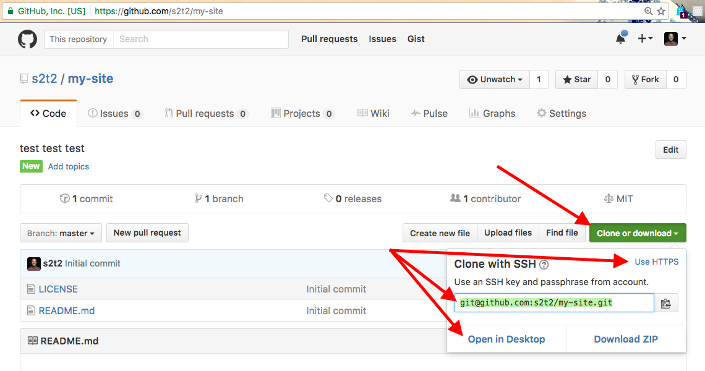

# Personal Website Checkpoint I: Structure

Create your own static website from scratch, and publish it online.

## Objectives

  1. Practice developing in a local environment.
  * Use a text editor to create and manage programmatic files.
  * Gain familiarity with HTML.
  * Practice software version control.
  * Practice website hosting.

## Prerequisites

  1. [Fork the Repo](/exercises/open-source/exercise.md).
  2. Configure a local development environment to include a text editor, a web browser, a local web server, and a version control client.

## Instructions

Your workflow will differ slightly depending on your chosen Git client.

### Configure Remote Repository

Create a new repository on GitHub called "my-site".

Then copy it to the Desktop or another folder on your local machine. Do this by either by noting its remote address and cloning it, or by choosing the "Open in Desktop" option if you have installed GitHub Desktop software on your local machine.



> NOTE: If cloning, later in the semester once you have configured your GitHub account to recognize your public key, prefer the SSH address. But for now, if you don't know about SSH, choose the HTTPS version of the address.

```` sh
# Mac Terminal:
cd ~/Desktop/

# Windows Command Prompt:
cd C:\Users\YOUR_USERNAME\Desktop\ # replace YOUR_USERNAME with the name of the user currently operating your local machine
````

```` sh
git clone REMOTE_REPOSITORY_ADDRESS # replace REMOTE_REPOSITORY_ADDRESS with the SSH or HTTPS address of your remote repository
````

### Develop Locally

Find the location of the local repository, navigate to it from the command line, and open it with a text editor of choice.

```` sh
cd my-site/
atom .
````

> NOTE: Subsequent instructions assume you have navigated to the root directory of the local repository. Some commands, like running the local web server, will only work if executed from within the root directory of your repository.

#### Edit HTML

Use your text editor to create a new file in the "my-site" directory called `index.html`. This can most likely be achieved with: "File > New", followed by "File > Save As".
Edit the `index.html` file using your text editor of choice.

Add basic html page structure (`html`, `head`, `body`, etc.), leveraging your text editor's auto-completion functionality as applicable. If you are not using a text editor that possesses auto-completion functionality, consider switching text editors or use the following code snippet:

```` html
<!DOCTYPE html>
<html>
  <head>
    <meta charset="utf-8">
    <title></title>
  </head>
  <body>

  </body>
</html>
````

Save the file.

Insert some sample text inside the `title` tag. Also add an `h1` heading tag and sample text within it to display the top-level page heading. Your code should now resemble:

```` html
<!DOCTYPE html>
<html>
  <head>
    <meta charset="utf-8">
    <title>Hello World | A website by me</title>
  </head>
  <body>
    <h1>Welcome to My Site</h1>
  </body>
</html>
````

Save the file again.

#### Preview Changes

Its time to preview your file in a browser. To do so, you may simply right-click on the file and open it with a browser, but you are encouraged to use a local web server instead.

> NOTE: You must execute the following command within the root directory which contains your index.html file!

After navigating to your directory, start a local web server on port 8888:

```` sh
# Mac Terminal:
python -m SimpleHTTPServer 8888 &

# Windows Command Prompt:
python –m http.server 8888
````

Finally, visit [localhost:8888](localhost:8888) in a browser to view your page.

#### Save Changes

Review, stage, and commit your changes to version control using your Git client of choice. Command-line instructions are as follows:

```` sh
git status
git diff # this won't display any detailed results at the moment because the index.html file has not yet previously been checked-in to version control. In the future this will display a rich line-by-line indication of all file modifications.
git add index.html
git commit -m "Create basic homepage structure"
````

Sync your local changes with the remote repository using your Git client of choice. Command-line instructions are as follows:

```` sh
git pull origin master # best practice is to always pull before pushing, in case other contributors have updated the contents of the remote repository.
git push origin master
````

### Configure Hosting

Configure GitHub Pages hosting, publish your website, and view it online.

### Iterate

Expand the HTML structure of your website as desired to meet project expectations. If you have not yet planned and designed your website, instead you may practice by expanding the HTML structure of your website to resemble that of https://prof-rossetti.github.io/student-site/, but using your own content.

Refer to http://www.w3schools.com/html/default.asp for HTML guidance. Include many of the HTML elements covered therein. Take your time to develop a baseline comfort with these elements.

As you develop your website, use an iterative development approach. Focus on small tasks one at a time. Edit your HTML file(s), preview your changes, then commit your changes. Then repeat the process.

Push your changes to the remote repository somewhat less frequently, at least once more before you are done.

Nice Job! You are developing like a pro!
