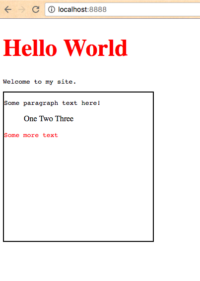
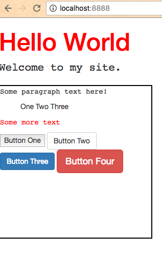

# Personal Website Checkpoint II: Style

Improve the look and feel of your static website.

## Objectives

  1. Gain familiarity with CSS, including selectors, and hexadecimal color notation.
  * Practice HTML.
  * Configure in-line, internal, and external CSS stylesheets.
  * Learn the benefits of code reuse, following the DRY principle.
  * Leverage a front-end web development framework.

## Prerequisites

  1. [Personal Website Checkpoint I: Structure](/projects/personal-website/checkpoints/structure/checkpoint.md)

## Instructions

Start with a simple `index.html` file. If you don't have one on hand, try one similar to the example below:

```` html
<!DOCTYPE html>
<html>
  <head>
    <meta charset="utf-8">
    <title>Hello | My Site</title>
  </head>
  <body>
    <h1>Hello World</h1>

    <p>Welcome to my site.</p>

    <div>
      <p>Some paragraph text here!</p>

      <ol>
        <li>One</li>
        <li>Two</li>
        <li>Three</li>
      </ol>

      <p>Some more text at the bottom.</p>
    </div>
  </body>
</html>
````

Reference http://www.w3schools.com/css/default.asp for CSS guidance. Try adding different inline style declarations and then preview how they look when applied in the browser.

Once you have chosen a variety of styles, try achieving the same website look and feel using different stylesheet configuration methods. Reference http://www.w3schools.com/css/css_howto.asp and the example instructions below for guidance on configuring stylesheets.

> NOTE: In case you end up using both an internal stylesheet and inline styles, the inline style declarations override the internal stylesheet declarations. Also, declarations that come later than others may override previous, related declarations. Be careful! If you're not sure why something looks the way it does, use the browser's "inspect" feature to see the "computed styles" of any element.

### Inline Styles

Configure your `index.html` page to use inline CSS styles. Refer to the following example, below:

```` html
<!DOCTYPE html>
<html>
  <head>
    <meta charset="utf-8">
    <title>Hello | My Site</title>
  </head>
  <body>
    <h1 style="font-size:48px; color: red;">Hello World</h1>

    <p style="font-family: monospace; color: '#ccc';">Welcome to my site.</p>

    <div style="border: 2px solid #000;">
      <p style="font-family: monospace; color: '#ccc';">Some paragraph text here!</p>

      <ol style="list-style:none;">
        <li style="display: inline;">One</li>
        <li style="display: inline;">Two</li>
        <li style="display: inline;">Three</li>
      </ol>

      <p style="font-family: monospace; color: 'red';">Some more text at the bottom.</p>
    </div>
  </body>
</html>
````

Preview this page in a browser and note its look and feel.



Now take another look back at the actual content of the HTML file. You'll note it looks messier than the original version. The styles are mixed-in with the structure, and neither is easy to distinguish from the other at a glance.

You'll also note repetition of declarations (e.g. `style="display:inline;"` declared on multiple `li` elements, and `style="font-family:monospace;"` applied to multiple `p` elements). This is not good. This repetition of code will make subsequent edits more time consuming and more prone to error. We must at all times seek to simplify, or "refactor" our code to maximize its reusability.

One way we can simplify these repetitious and distracting style declarations is by abstracting them into a single stylesheet.

### Internal Stylesheet

Configure your `index.html` page to use an internal stylesheet.

When moving from inline styles to a stylesheet, collect all your style declarations in one place, and use references known as **selectors** to specify which elements to apply the style declarations. See http://www.w3schools.com/css/css_syntax.asp and http://www.w3schools.com/cssref/css_selectors.asp for more information about CSS selectors. Three common selection methodologies are to:

  1. Reference the element by its type (e.g. `div`)
  2. Reference the element by its `id` attribute value (e.g. `div#some-unique-identifier` or simply `#some-unique-identifier`)
  3. Reference the element by one of its `class` attribute values (e.g. `div.some-shared-identifier` or simply `.some-shared-identifier`)

> NOTE: No two elements on the same page should share an `id` attribute value, whereas it is common for multiple elements on the same page to share a `class` attribute value. Both `id` and `class` attributes are used to identify and classify elements.

```` html
<!DOCTYPE html>
<html>
  <head>
    <meta charset="utf-8">

    <title>Hello | My Site</title>

    <style media="screen">

      h1 {
        font-size:48px;
        color: red;
      }

      p {
        font-family: monospace;
        color: '#ccc';
      }

      div#my-divider {
        border: 2px solid #000;
        height: 300px;
        width: 300px;
      }

      ol { list-style:none; }

      li.horizontal { display: inline; }

      .bottom { color:red; }

    </style>
  </head>
  <body>
    <h1>Hello World</h1>

    <p>Welcome to my site.</p>

    <div id="my-divider">
      <p>Some paragraph text here!</p>

      <ol>
        <li class="horizontal">One</li>
        <li class="horizontal">Two</li>
        <li class="horizontal">Three</li>
      </ol>

      <p class="bottom">Some more text</p>
    </div>
  </body>
</html>
````

Check back in your browser to ensure your page looks the same as it did before.

> NOTE: If you do not see the styles applied, the most common reason is that you may have specified the wrong selectors.

Nice job. By abstracting and combining disparate combinations of style declarations in this way, you are reducing code duplication, which in turn reduces the effort associated with making future edits as well as the likelihood of manual error.

> NOTE: The practice of abstracting, simplifying, and sharing code declarations to avoid repetition is commonly referred to as **DRY**, or "Don't Repeat Yourself". There is at least one other opportunity to DRY-up the code in this most recent example. Can you spot it?

Notice, there's still a lot going on in this simple `index.html` file. We open the file to see multiple lines of style declarations at the top, and not until we scroll down do we start to understand the structure of this HTML file.

We can simplify our view even further by separating the style declarations into a different file.

### External Local Stylesheet

Configure your `index.html` page to use an external stylesheet located in the same directory.

First create a new CSS file called `my-style.css` in the same directory as your `index.html` file, but nest it inside one or more subdirectories (e.g. `assets/styles/my-style.css`). Then move all of the existing style declarations into it:

```` css

/* THIS IS MY EXTERNAL STYLESHEET */

h1 {
  font-size:48px;
  color: red;
}

p {
  font-family: monospace;
  color: '#ccc';
}

div#my-divider {
  border: 2px solid #000;
  height: 300px;
  width: 300px;
}

ol { list-style:none; }

li.horizontal { display: inline; }

.bottom { color:red; }

````

Finally, in the `head` of your original `index.html` file, change the `style` element to a `link` element, and configure its `href` attribute value to point to the location of the new external stylesheet:

```` html
<!DOCTYPE html>
<html>
  <head>
    <meta charset="utf-8">
    <title>Hello | My Site</title>
    <link rel="stylesheet" type="text/css" href="assets/styles/my-style.css">
  </head>
  <body>
    <h1>Hello World</h1>

    <p>Welcome to my site.</p>

    <div id="my-divider">
      <p>Some paragraph text here!</p>

      <ol>
        <li class="horizontal">One</li>
        <li class="horizontal">Two</li>
        <li class="horizontal">Three</li>
      </ol>

      <p class="bottom">Some more text</p>
    </div>
  </body>
</html>
````

Check back in your browser to ensure your page looks the same as it did before.

> NOTE: If you do not see the styles applied, the most common reason is that you may have specified the wrong CSS file path.

Much better! This approach results in files that are easier to read and more organized than the previous approaches. It is also more organized in the sense that the structural logic is separated from the style logic.

This approach also allows you to reference the same stylesheet from different HTML pages. Give this a try yourself by linking to the same stylesheet from another HTML file. In this way, you can easily achieve consistent styles across all pages in your website.

### External Hosted Stylesheet

Configure your HTML page to use an external hosted stylesheet, specifically Twitter Bootstrap. This usually involves swapping the existing stylesheet `link` with something like the following: `<link rel="stylesheet" href="https://maxcdn.bootstrapcdn.com/bootstrap/3.3.7/css/bootstrap.min.css" integrity="sha384-BVYiiSIFeK1dGmJRAkycuHAHRg32OmUcww7on3RYdg4Va+PmSTsz/K68vbdEjh4u" crossorigin="anonymous">`.

Refer to http://getbootstrap.com/getting-started/#download-cdn for guidance.

### Style

Use Twitter Bootstrap to style your site as desired! Refer to http://getbootstrap.com/css/ and http://getbootstrap.com/components/ for more documentation and examples.

You might end up with something like the following example:

```` html
<!DOCTYPE html>
<html>
  <head>
    <meta charset="utf-8">
    <title>Hello | My Site</title>
    <link rel="stylesheet" href="https://maxcdn.bootstrapcdn.com/bootstrap/3.3.7/css/bootstrap.min.css" integrity="sha384-BVYiiSIFeK1dGmJRAkycuHAHRg32OmUcww7on3RYdg4Va+PmSTsz/K68vbdEjh4u" crossorigin="anonymous">
    <link rel="stylesheet" type="text/css" href="assets/styles/my-style.css"><!-- try removing this link and/or switching the order of the two links and see what happens. order matters! -->
  </head>
  <body>
    <h1>Hello World</h1>

    <p class="lead">Welcome to my site.</p>

    <div id="my-divider">
      <p>Some paragraph text here!</p>

      <ol>
        <li class="horizontal">One</li>
        <li class="horizontal">Two</li>
        <li class="horizontal">Three</li>
      </ol>

      <p class="bottom">Some more text</p>

      <button>Button One</button>
      <button type="button" class="btn btn-default">Button Two</button>
      <button type="button" class="btn btn-primary">Button Three</button>
      <button type="button" class="btn btn-lg btn-danger">Button Four</button>

    </div>
  </body>
</html>
````



Commit and push your changes when finished, then view them live on your hosted site.
