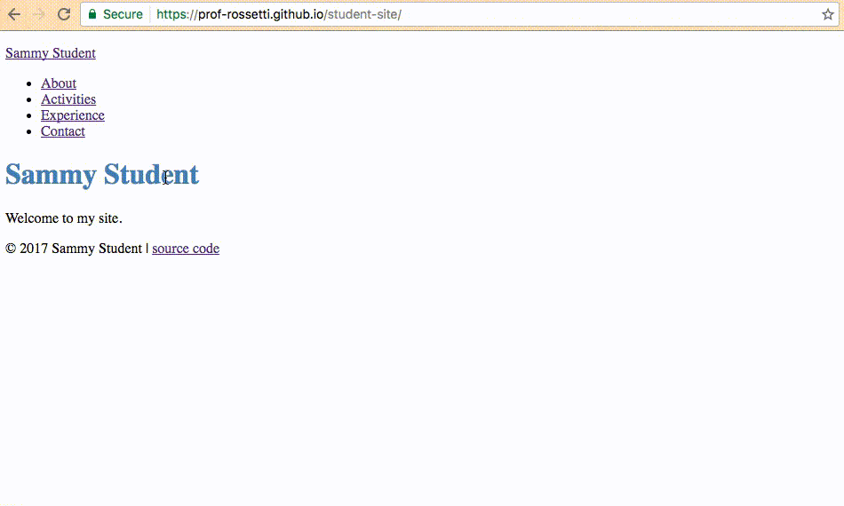

# Personal Website

Plan, design, and develop a website for personal or professional purposes.

Your website should contain at least three different .html files,
 as well as any scripts, images, and icons needed for proper function and form. The site should maintain consistent style and navigation across pages.

You may use a front-end web development framework
 like [Twitter Bootstrap](http://getbootstrap.com/getting-started/#download-cdn)
 to reduce development efforts and conform to familiar web standards.

## Objectives

  1. Engage in a deliberate lifecycle of software planning, design, and implementation.
  * Practice software version control.
  * Produce a static website from conception to completion.
  * Leverage technology as an outlet for creativity.

## Instructions

### Plan

Your website must exist for one or more practical purposes. First create a planning document which details the objective(s) of your website. Also describe how you will know if your website has succeeded in accomplishing its objectives. Include all planning documents in your project repository in a directory called `/planning`.

### Design

Then design the look and feel of your website by producing drawings or other illustrative representations. You may choose to use pencil and paper, whiteboard, digital design tools, etc. If your design documents don't start in digital format, take a picture or otherwise scan them into digital format. Include all design documents in your project repository in a directory called `/design`.

### Implement

Once you are satisfied with the planned objectives of the site and its ability to meet those objectives as designed, begin developing your website.

Continue developing your website until you are satisfied with its representation of your original design and its ability to meet its stated objectives.

Ensure the website is hosted and available for public consumption on the Internet.

## Submission Instructions

When your project is ready for evaluation, add its identifying information, including your GitHub username, a link to your site's repository, and a link to your hosted site, to the [submissions list](submissions.md). Use the following workflow to accomplish this:

  1. Fork [this repository](https://github.com/SCSU-CSC-Department/201701-csc-443-01/) to your own account.
  * Edit the submissions list in your forked repo via the online editor, or by downloading your forked repo, making local commits, and pushing them back up to GitHub.
  * Submit a Pull Request for your changes to be merged into this repo.

> NOTE: If you would prefer for any reason to submit your work privately, you may alternatively send the professor your links via email or Slack DM. Your project will still be evaluated, and peer-evaluated, but its identifying information will not be publicly accessible as part of this course repository.

Also be prepared to deliver a 5-10 minute presentation to demonstrate usage of your website and describe your planning and design process, as desired.

## Evaluation Criteria

Your website will be evaluated according to the following criteria:

criteria | weight
--- | ---
Planning and Design | 25%
Implementation | 50%
Peer Evaluation | 25%

Partial credit may be given to highlight areas of improvement.

### Planning and Design Evaluation

Your website planning and design documents will be evaluated for presence, clarity, and thoroughness.

### Implementation Evaluation

Your website implementation will be evaluated based on its demonstrated ability to meet all of the following criteria:

  1. Is hosted on the Internet and publicly accessible.
  + Contains clear, concise, and engaging content free of typographical or grammatical mistakes.
  + Contains at least three different pages, each including navigation links to all other pages.
  + Creative and usable design free of usability quirks or bugs.
  + Contains at least one of each of the following HTML elements:
    + `<h1>` and/or other [headings](http://www.w3schools.com/html/html_headings.asp) as necessary
    + `
`
    + `
`
    + `<a>`
    + `<ul>` or `<ol>`, in conjunction with multiple `<li>` elements
    + ``
    + `<script>` or link to an external .js script
    + `<style>` or link to an external .css stylesheet
    + at least one [HTML5 semantic element](http://www.w3schools.com/html/html5_semantic_elements.asp) like `<header>`, `<footer>`, `<nav>`, etc.
  + Assigns `id` and/or `class` attribute values as appropriate to produce proper form and function.

#### Peer Evaluation

All members of the learning community, including the professor, will engage in a [peer evaluation process](peer-evaluation.md) which will result in the assignment of individual peer evaluation scores. A weighted average of these individual scores will produce the overall Peer Evaluation Score.
