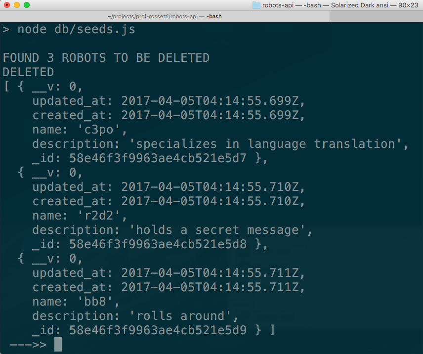

# REST API Checkpoint II: Seeding the Database

Configure your MongoDB development database and populate it with example data.

## Objectives

  + Create, populate, and query a MongoDB development database
  + Practice running NPM commands and registering NPM scripts

## Prerequisites

  + [REST API Checkpoint I: Serving Static Responses](/projects/rest-api/checkpoints/static-responses/checkpoint.md)
  + [MongoDB Overview](/notes/databases/mongodb/notes.md)
  + [Mongoose Overview](/notes/javascript/mongoose.md)

Verify MongoDB is installed and working:

```` sh
which mongo
mongo --version
mongo
> show dbs
> exit
````

## Instructions

### Setup the Development Database

Prerequisite: make sure you have MongoDB installed in your development environment. Then install locally the `mongoose` NPM package, which provides a JavaScript interface into MongoDB:

```` sh
npm install mongoose --save
````

To configure a new MongoDB connection, add a new file called `db.js` (for example) and paste in the following contents:

```` js
var mongoose = require('mongoose');

var mongoConnectionString = process.env.MONGODB_URI || 'mongodb://localhost/robots-api';

mongoose.connect(mongoConnectionString); // establishes a database connection which may in some cases need to be manually closed via disconnect();

module.exports = mongoose;
````

To define a MongoDB database schema, add a file called `models/robot.js` (for example) and paste in the following code:

```` js
var mongoose = require('mongoose');
var Schema = mongoose.Schema;

var RobotSchema = new Schema(
  {
    name : {
      type: String,
      required: true
    },
    description : {
      type: String,
      required: true
    }
  },
  {
    timestamps: { // include timestamp attributes in the schema and automatically assign values on create and update, respectively
      createdAt: 'created_at', // rename from createdAt
      updatedAt: 'updated_at' // rename from updatedAt
    }
  }
);

module.exports = mongoose.model('Robot', RobotSchema);
````

### Populate (Seed) the Development Database

Add a new file called `db/seeds.js` (for example) and paste in the following contents:

```` js
var db = require("../db"); // starts a mongoose connection
var Robot = require("../models/robot"); // loads the Robot schema and its helpful ORM functions like .find(), .remove(), and .create()

var exampleRobots = [
  {name:"c3po", description:"specializes in language translation"},
  {name:"r2d2", description:"holds a secret message"},
  {name:"bb8",  description:"rolls around"}
];

// Find all the robots.

Robot.find(function (err, robots) {
  if (err) return console.error(err);
  console.log("FOUND", robots.length, "ROBOTS TO BE DELETED")

  // Delete all the robots.

  Robot.remove(robots, function (err) {
    if (err) return console.error(err);
    console.log("DELETED")

    // Create all the robots.

    Robot.create(exampleRobots, function (err, newBots) {
      console.log(newBots)
      db.disconnect(); // closes the mongoose connection, else it will keep running, which is appropriate for when the web server runs, but not for a script like this.
    });
  });
});
````

Run this script to populate the database with those three example records:

```` sh
node db/seeds.js
````



### Query the Development Database

At this point, you should be able to login to MongoDB to confirm existence of a database called `robots-api`, a database collection called robots, and three example robot records.

```` sh
mongo
> show dbs
> use robots-api
> show collections
> db.robots.find().pretty()
> exit
````

Congratulations, you are querying the development database like a PRO!
