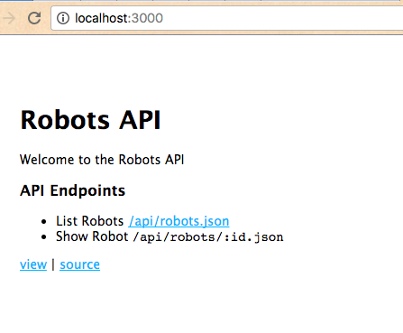
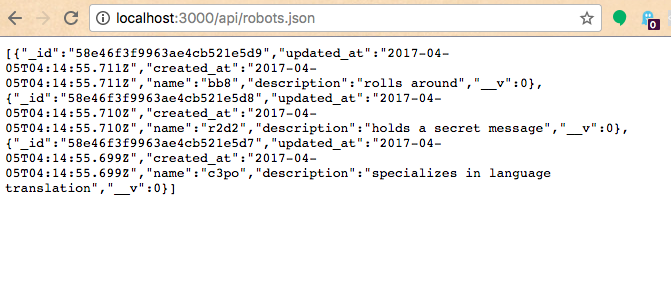
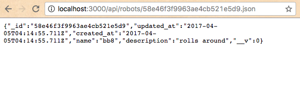

## REST API Checkpoint III: Serving Dynamic Responses to GET Requests

Connect the web server to the database, and serve dynamic responses at all of the application's GET request endpoints.

## Objectives

  + Gain exposure to making database calls from within the context of an Express application, and passing database data to the application's views.
  + Practice using an Express web application to handle processing of GET requests.

## Prerequisites

  + [REST API Checkpoint II: Seeding the Database](/projects/rest-api/checkpoints/database-seeding/checkpoint.md)
  + "Verify" your Heroku account by adding credit card information at https://heroku.com/verify. Don't worry, you shouldn't be charged for the resource usage levels recommended by this guide.

## Development Environment Instructions

These instructions describe the process of configuring the development web server to connect to, and query the development database.

### Connect to the Development Database

To configure the web server to start a database connection on start-up, add the following code near the top of the `app.js` file, above the lines where you are requiring your routers:

```` js
// ...
var db = require("./db") // this line is new
var index = require('./routes/index'); // this was here before
var robotsApi = require('./routes/api/robots'); // this was here before
// ...
````

### Query the Development Database

Edit the `routes/api/robots.js` file to resemble the following:

```` js
var express = require('express');
var router = express.Router();
var Robot = require("../../models/robot");

/* List Robots (GET) */

router.get('/api/robots', function(req, res, next) {
  Robot.find( function (err, robots) {
    if (err) {
      console.log(err)
      res.send("OOPS. SERVER ERROR.");
    } else {
      console.log("LIST", robots.length, "ROBOTS:", robots);
      res.send(robots.reverse());
    }
  });
});

/* Show Robot (GET) */

router.get('/api/robots/:id', function(req, res, next) {
  console.log(req.params)
  const robotId = req.params.id;

  Robot.findById(robotId, function(err, robot) {
    if (err){
      errorMessage = `OOPS. SERVER ERROR. Couldn't Show robot ${robotId}. ${err} Please double-check you are requesting a robot with a valid identifier. Try listing all robots to see some examples.`
      console.log(errorMessage)
      res.send(errorMessage);
    } else {
      console.log("SHOW ROBOT", robot);
      res.send(robot);
    };
  });
});

module.exports = router;
````

Note the routers are querying the database and passing the results back via response. Also there's some error-handing, but nothing to crazy. The trick here is reading the mongoose documentation for the `find()` and `findById()` methods.

Visit the endpoints again in your browser to verify the database data is getting passed through in the response.

Index Page:



List Robots API Endpoint:



Show Robot API Endpoint:



## Production Environment Instructions

### Configure Production Database

You've configured your development application to connect to a development database on your local machine, but when you push your application to Heroku, you'll notice you also need to configure a production database. Fortunately, Heroku makes it easy to create a MongoDB "addon".

```` sh
heroku addons:create mongolab:sandbox
````

> If you get an error complaining about verifying your account, you need to enter your credit card with your Heroku account. Don't worry, the `mongolab:sandbox` addon is free. Sorry you have to enter your credit card info. But again, you shouldn't be charged at this low level of resource usage.

When you create the `mongolab:sandbox` addon, it creates a remote production database server and associates its address with an environment variable called `MONGODB_URI` on the application server.

This will work for us because we have already configured the MongoDB connection string in our `db.js` file to search for an environment variable on the server called `MONGODB_URI`.

### Deploy to Production

Commit your changes to version control if you have not yet done so, then push them to the remote repository, then to the Heroku production application server:

```` sh
git push heroku master
heroku open
````

Test out your GET request endpoints in production. The API is serving appropriate responses for all GET request endpoints! Be proud because this is a major accomplishment.
