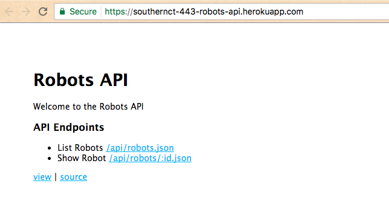
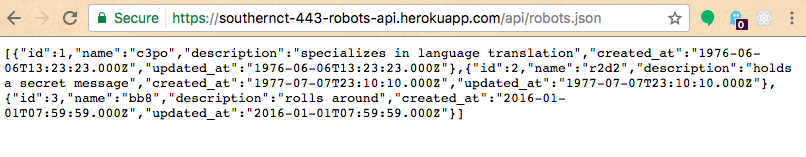
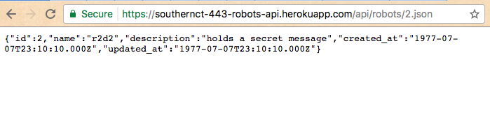

# REST API Checkpoint I: Serving Static Responses

Generate a new Express application, deploy it to Heroku, then configure its routing to serve static responses at all of its GET request endpoints.

## Objectives

  + Practice generating an Express web application.
  + Practice configuring the routing and navigation of an Express web application.
  + Practice deploying an Express web application to a production environment hosted by Heroku.
  + Practice using an Express web application to handle processing of GET requests.

## Prerequisites

  + [CRUD Application Project](/projects/crud-application/project.md)

## Instructions

### Application Generation

```` sh
express robots-api --view=ejs
git init .
git add .
git commit -m "Generate new express application"
heroku create southernct-443-robots-api
atom .
````

```` sh
npm install
````

### Application Configuration

Add a .gitignore file:

```` sh
node_modules/
````

Add a `Procfile` file:

```` sh
web: node ./bin/www
````

To use the nodemon development web server: in the `package.json` file, change `"start": "node ./bin/www"` to `"start": "nodemon ./bin/www"` (assuming you have already run `npm install nodemon -g` to install it globally on your development machine).

Start a local web server:

```` sh
DEBUG=my_app:* npm start
````

### Application Deployment

Check it out in a browser at localhost:3000. It says "Welcome to Express." Good enough to deploy. Configure a remote repository, then deploy.

```` sh
git remote add origin git@github.com:prof-rossetti/robots-api-express.git
git push origin master
git push heroku master
heroku open
````

It says "Welcome to Express." Success. Application Generation, Configuration, and Deployment. Not too hard.

### Application Routing

Time to configure routing to each of the API endpoints.

Add new `DOCUMENTATION.md` file and describe GET request endpoints.

Covert users router to a robots API router. Add links to the various endpoints from the index page for easy navigation. Serve static data at the GET request endpoints.

Index Page:



List Robots API Endpoint:



Show Robot API Endpoint:


